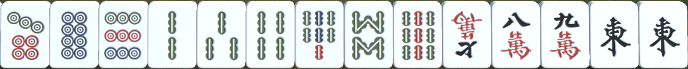

# 3D Mahjong

## About the Project
### Overview
This is a personal project. I grew up playing Mahjong with my family and have come to love it. I'm making this game because I want to continue playing despite being away from my family.

The project includes an engine for choosing bot discards, a sorting algorithm for the player's hand, and a brute-force algorithm for searching where to put a discard in the throw area.

## Game Mechanics
Filipino Mahjong is probably the simplest version of Mahjong. Each player receives 16 tiles and takes turns drawing and discarding tiles. The dealer (mano) draws first then discards a tile. You can type "pong", "kang", or "chao" to take this discard if you need it. If no one wants to take the discarded tile, the player to his right draws next.

The goal is to reach a winning hand, where a player has one pair (eye) and all the remaining tiles are complete sets (meld).

Example of a winning hand:

These are the possible sets:
1. **Pong**. Three-of-a-kind
> 
2. **Kang**. Four-of-a-kind
> 
3. **Chao**. Three consecutive tiles of the same suit
> 

### Demo
in img/GameDemo.mp4:

## Planned Features
+ Panel after winning
+ Main Menu
+ Online Multiplayer using WebSockets
